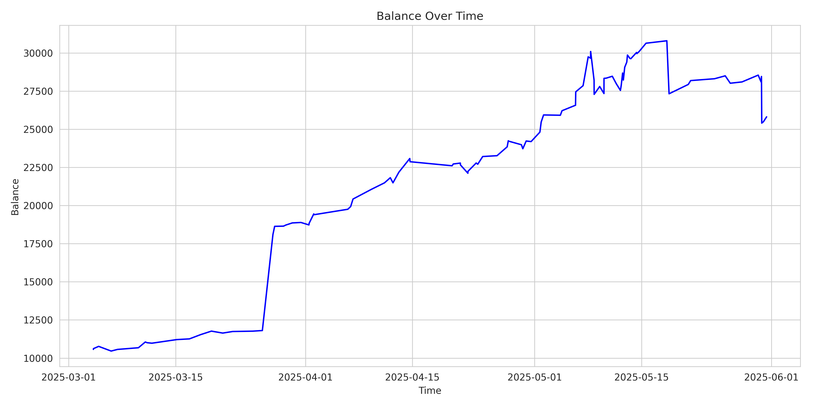
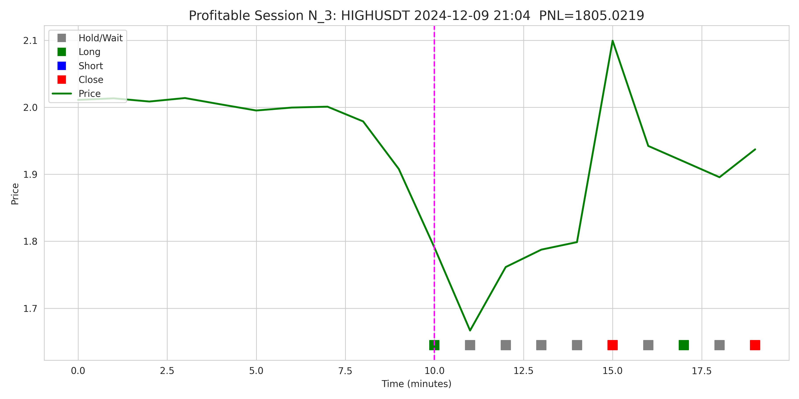
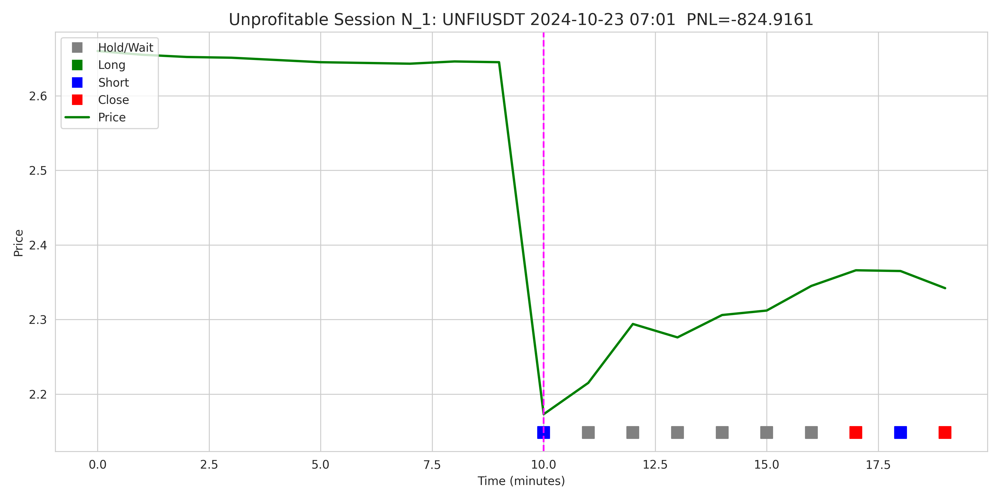
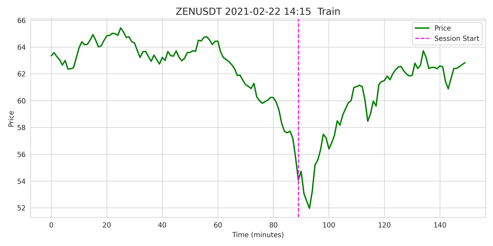
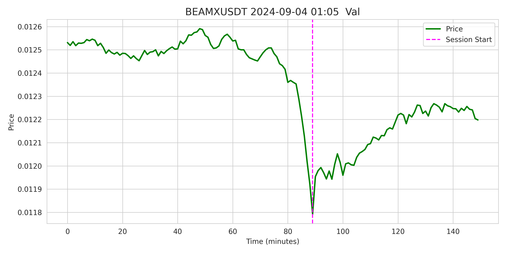
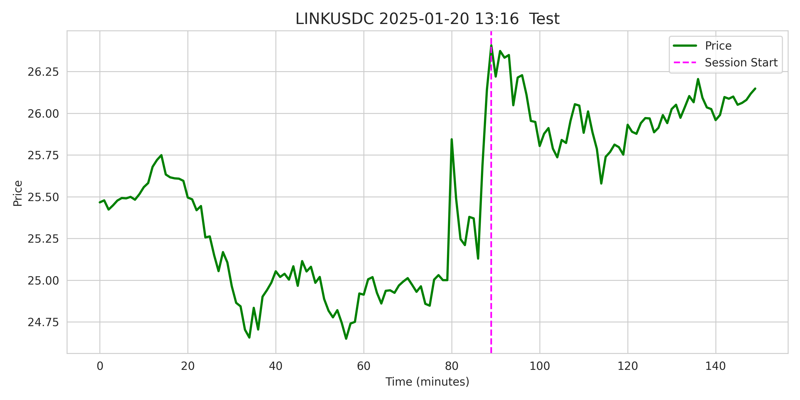
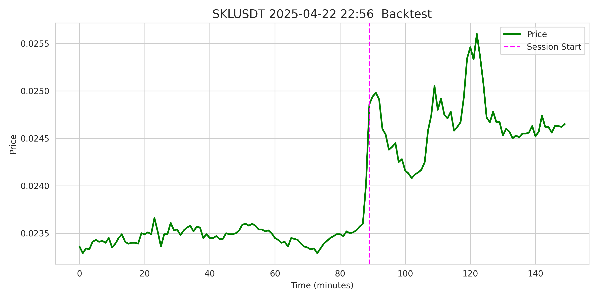
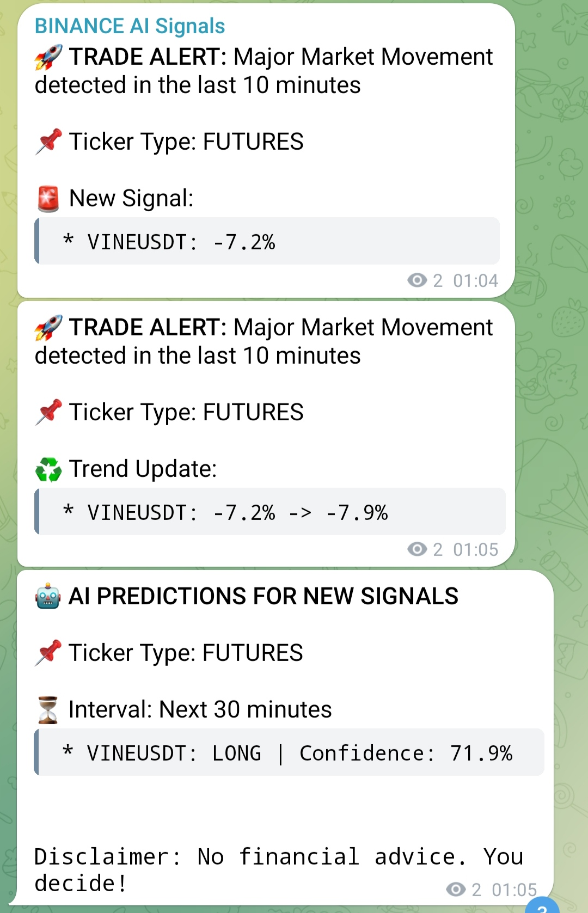
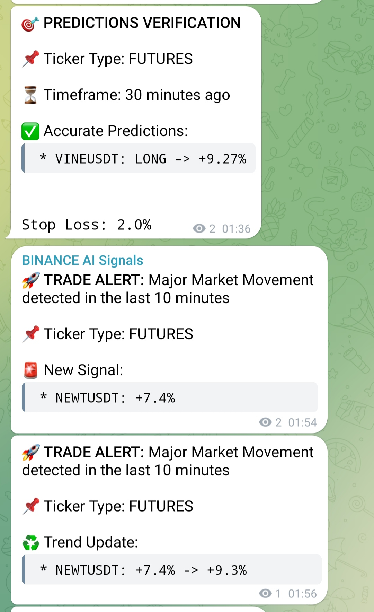

# 🧠 Open RL Trading Agent for Binance Futures

**Reinforcement Learning-based agent for intraday trading on Binance Futures**, built with D3QN + Prioritized Experience Replay. Designed for realistic backtesting, live trade decision-making, and reproducible experimentation.

---

## 📌 Overview

This repository provides a full-stack trading system built around a Deep Q-Learning agent trained on real Binance Futures minute-level data. It supports:

* Realistic simulation of volatile trade sessions
* Dueling Double DQN with Prioritized Replay Buffer
* End-to-end pipeline: training, testing, backtesting, and hyperparameter tuning
* Modular architecture with config-based reproducibility

> **Demo Mode**: This version uses a lightweight model (\~256K params) with short sessions (10min) and minimal context (30min) for accessibility and fast execution. The full pipeline is GPU-free and runs on CPU.

---

## 📈 Performance Summary

### 🔹 Test Results (RL Agent)

```
Mean Reward:     0.00285
Mean PnL:       +28.47 USDT
Win Rate:       55.67%
```

### 🔹 Backtest Results

```
Final Balance Change:  +144.23%
Sharpe Ratio:          1.85
Sortino Ratio:         2.05
Accuracy:              69.6%
Profit Days:           78.57%
Max Drawdown:         -22.49%
Avg Trade Amount:      11324.29 USDT
Trades per Day:        2.00
```



### 🔹 Baseline (CNN Classifier)

```
Mean PnL:       –27.95 USDT
Win Rate:        47.85%
ROC AUC:         47.33%
```

---

## 🧠 Architecture

* **Environment**: Custom Gym-compatible `TradingEnvironment`
* **Agent**: D3QN with epsilon decay, PER buffer, and Q-value caching
* **Model**: CNN feature extractor + Dueling head (Value + Advantage)
* **Baseline**: Supervised CNN classifier with identical architecture
* **Backtest**: Realistic execution, Q-value caching, risk-management, strategy filters

---

## 🧪 Dataset

Curated minute-level dataset with high-volatility signals and trading sessions.

| Set      | Period                  | Size   | Purpose    |
| -------- | ----------------------- | ------ | ---------- |
| Train    | 2020-01-14 → 2024-08-31 | 24,104 | Training   |
| Val      | 2024-09-01 → 2024-12-01 | 1,377  | Validation |
| Test     | 2024-12-01 → 2025-03-01 | 3,400  | Evaluation |
| Backtest | 2025-03-01 → 2025-06-01 | 3,186  | Simulation |

🔗 [open-rl-trading-binance-dataset (HuggingFace)](https://huggingface.co/datasets/ResearchRL/open-rl-trading-binance-dataset)

---

## 🚀 Quickstart

### 1. Train the agent

```bash
python train.py configs/alpha.py
```

### 2. Evaluate on test set

```bash
python test_agent.py configs/alpha.py
```

### 3. Backtest on real market signals

```bash
python backtest_engine.py configs/alpha.py
```

### 4. Run CNN baseline

```bash
python baseline_cnn_classifier.py configs/alpha_baseline_cnn.py
```

### 5. Optimize backtest config (Optuna)

```bash
python optimize_cfg.py configs/alpha.py --trials 100 --jobs 1
```

---

## 📂 Project Structure

```
rl_trading_binance/
├── train.py               # RL training
├── test_agent.py          # Testing agent
├── backtest_engine.py     # Full backtest engine
├── optimize_cfg.py        # Optuna-based optimization
├── baseline_cnn_classifier.py
├── config.py              # Config base model
├── configs/               # Experiment configs
├── model.py               # CNN + Dueling Q-network
├── agent.py               # D3QN agent logic
├── replay_buffer.py       # Prioritized Replay (SumTree)
├── trading_environment.py # Gym-compatible env
├── utils.py               # Logging, plots, metrics
├── data/                  # Market datasets (NPZ format)
│   ├── train_data.npz
│   ├── val_data.npz
│   ├── test_data.npz
│   └── backtest_data.npz
├── output/                # Experiment artifacts
│   └── <config_name>/
│       ├── logs/
│       ├── plots/
│       └── saved_models/
```

---

## 📊 Visual Examples

| Profitable Session                  | Unprofitable Session                  |
| ----------------------------------- | ------------------------------------- |
|  |  |


| Train Example                                             | Val Example                                               | Test Example                                              | Backtest Example                                           |
|-----------------------------------------------------------|------------------------------------------------------------|------------------------------------------------------------|------------------------------------------------------------|
|      |      |      |    |


---

---

## 📣 Live Agent (Telegram Bot)

A more advanced real-time AI agent has been deployed and is actively analyzing Binance Futures markets.

Every minute it:

* Monitors all tickers for major volatility shifts
* Detects and posts new trading signals with confidence levels
* Tracks signal evolution and verifies prediction outcomes
* Publishes both open and closed positions along with PnL

This system is a live demonstration of how reinforcement learning can operate under production constraints with streaming data and discrete decision-making.

👉 Follow here: [@binance\_ai\_agent](https://t.me/binance_ai_agent)

> ⚠️ Educational use only. No financial advice.

| Live Signal + Prediction              | Verification Example             |
| ------------------------------------- | -------------------------------- |
|  |  |

---

## 🧭 Future Work

* Switch to iTransformer / Perceiver / A3C / PPO / SAC / Dreamer / DDPG / TD3
* Longer context: 90min + 60min sessions
* Streamed execution via Binance API + TimescaleDB + Airflow

---

## ⚖️ License

MIT License

---

